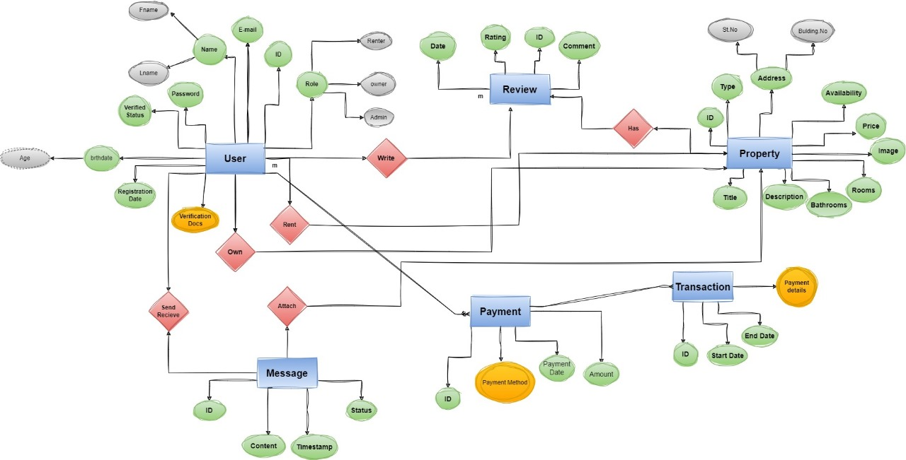

# FORENT Website Back-End

### This is Our Structure for Database that we have:

* User

  - ID
  - Name
  - Email
  - Password
  - Birthdate
  - Role

    - Renter
    - Owner
    - Admin
  - Registration date
  - Validation state

  ---
* Property
* Reviwe
* Transaction
* Payment
* Message

### ERD

---
